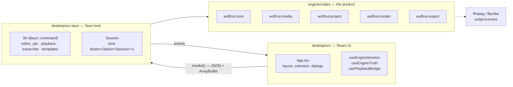
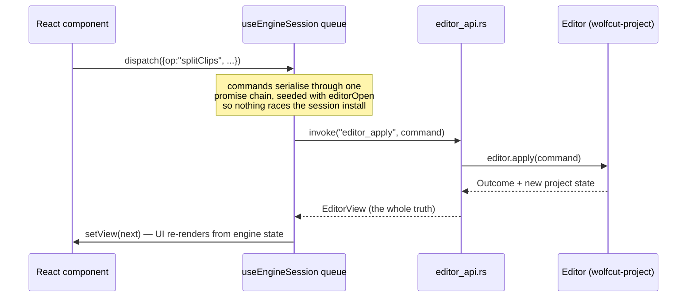
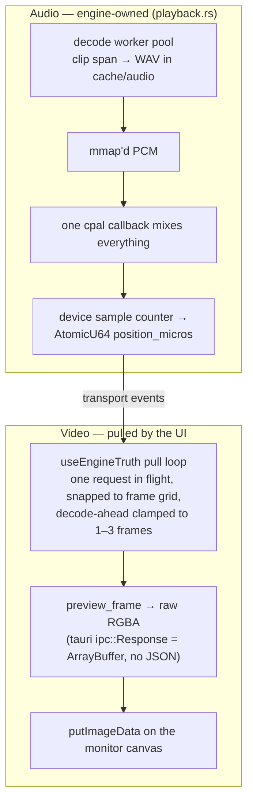

# WolfCut Architecture

A study map of the system as it stands (August 2026): what each layer owns, how
they talk, where the sharp edges are, and what deserves attention next. File
references are current as of this writing.

---

## 1. The three layers and the one rule

**The rule (engine doctrine):** everything important lives in the engine
crates. The Tauri host is plumbing; the UI renders state and sends commands.
The engine owns the project model, the undo history, the render path, the
document format. When a feature is being designed, the first question is
"which engine crate does this belong to" — TS holds only what the UI
genuinely owns (layout, selection, in-flight gestures).

The engine crates keep a strict dependency arrow (see `engine/README.md`):
`core` depends on nothing, everything else depends inward, and `wolfcut-project`
knows nothing about rendering. The desktop crate consumes the engine as path
dependencies — deliberately *not* one workspace, so the engine builds, tests
and versions alone.

| Crate | LOC | Owns |
|---|---|---|
| `wolfcut-core` | ~1.4k | Rational time, frame model, arena handles, timeline model. Zero dependencies. |
| `wolfcut-media` | ~3.0k | Everything FFmpeg: probe, subprocess decode/encode, reader pool with byte-budgeted LRU frame cache, waveform peaks. Optional `ffi` feature links FFmpeg for exact seeks. |
| `wolfcut-project` | ~3.3k | The document: model, every edit command (`commands.rs`, ~1.3k), undo `Editor`, wolfcut.json round-trip. |
| `wolfcut-render` | ~1.3k | Compositing. `CpuCompositor` is the reference; `WgpuCompositor` behind the `gpu` feature, falls back cleanly when no GPU. |
| `wolfcut-export` | ~2.2k | Timeline → file: flatten, filtergraph builders (`chains.rs`), the frame-by-frame render loop. |
| `wolfcut-cli` | ~0.2k | Probe/render vertical slice for testing the engine without the app. |

---

## 2. The edit loop — how a keystroke becomes truth

The engine owns the project; the UI never mutates its own copy of the model.
Every edit round-trips:

Key properties:

- **One queue.** Commands serialise so responses can never land out of order
  and overwrite newer state with older (`useEngineSession.ts`).
- **The echo layer.** Drags don't send a command per pixel. The UI previews
  the gesture locally ("echo"), using arithmetic mirrored from the engine,
  and commits **one** command per gesture on release — so undo undoes the
  drag, not a pixel of it. The echo clears only after the engine's state
  arrives, so nothing flashes back mid-flight.
- **Undo lives in the engine** — a bounded history of full `Project` clones
  (depth 200), not command inversion.
- **Autosave** debounces 1.5 s after any state change; the engine writes the
  document (temp file + rename, so a crash mid-save can't truncate the
  project).
- **Wire types are generated.** `EditorView`, `Command` and friends are
  ts-rs exports from the Rust types into `desktop/src/lib/generated/`;
  CI fails if the committed files drift from the Rust source of truth.

---

## 3. Preview & playback — two clocks, one truth

Audio and video take different paths, deliberately (desktop decisions 0005,
0009 — see §7):

- **The audio device is the only clock.** The transport thread publishes
  position; the UI interpolates between events. Video chases audio, never
  the other way around.
- **The monitor draws the engine's real composited frame** — the same
  pixels the exporter would produce — at `previewQuality` (default 0.5)
  to keep the per-frame RGBA copy over IPC affordable.
- **Effects preview in two grades:** live approximations (CSS filters /
  canvas ops in `lib/effects.ts`) during interaction, engine truth for the
  monitor. The export is "only ever a higher-quality version of what you
  already saw."
- All 15 byte-shipping commands use `tauri::ipc::Response` (ArrayBuffer),
  so no base64 or number-array serialisation on the hot paths. The one
  exception: `write_artwork(bytes: Vec<u8>)` serialises inbound as a JSON
  number array.

---

### 3.1 Proxy media

Seeking through the subprocess backend costs a fresh FFmpeg per jump, because
a pipe cannot seek (`pool.rs`, `Reader::seek`). Measured on a Windows machine
with the full FFmpeg build: a preview frame from 4K is ~260 ms, of which
~70 ms is starting the process and the rest is the decode; a drag of the
playhead is several of those in a row, which is the "the picture catches up a
second later" complaint.

`wolfcut-media::proxy` builds small stand-ins and `ReaderPool::use_proxies`
substitutes them. Numbers behind the choices, all measured rather than
assumed:

| | seek | drag of 6 |
|---|---|---|
| 4K original | 261 ms | 1570 ms |
| 4K, 540p proxy | 101 ms | 608 ms |
| 1080p original | 134 ms | 806 ms |
| 1080p, 540p proxy | 89 ms | 715 ms |

- An **all-intra** proxy seeks no faster than one keyed every 12 frames (90 vs
  85 ms) and is three times the size. Keyframe distance is not the bottleneck.
- **Hardware decoding** is *slower* for this: 411 ms against 338 for a single
  frame, because initialising the decoder and reading the frame back costs
  more than it saves when you only want one.
- `ROLL_FORWARD_FRAMES` = 60 is close to right. Rolling costs ~1.7 ms/frame,
  so it breaks even against a seek at about 75.
- The floor is the process spawn, which no proxy can remove: measured from
  Rust with a direct `CreateProcess`, `ffmpeg -version` costs **68 ms** and a
  trivial `cmd /c exit` costs **55 ms**. So FFmpeg's own start-up is only
  ~13 ms of it and the rest is Windows creating a process at all. Two things
  follow. Shipping a smaller FFmpeg build cannot help - 13 ms is the whole
  prize. And 55 ms for a trivial process is far above the usual 10-20, which
  points at per-process security scanning on this machine rather than at
  anything the app does; the FFI decoder (§6.6) removes the spawn entirely and
  so removes both, but its benefit will look smaller on a machine that creates
  processes at normal speed.

  Measure this from Rust, not from a shell. The same figures taken through Git
  Bash read ~25 ms high, and an earlier version of this section quoted them.

**Why this is safe:** the pool is the preview path and only the preview path —
the exporter opens its own `FfmpegDecoder`s on the originals (`export/lib.rs`)
— so a proxy has no route into a finished file. That is structural, not a rule
someone has to remember. The one invariant that needs a test is that a proxy
shows the *same moment* as its original, since a cut placed against a preview
a few frames out of step is wrong everywhere except on screen;
`tests/proxy_substitution.rs` decodes both at the same timestamps and compares
pixels.

---

## 4. Export

Hybrid pipeline in `wolfcut-export`:

- **Picture:** flattened timeline → per-frame composition in-process
  (CPU or wgpu) → raw frames piped into one `ffmpeg` encode subprocess.
- **Audio:** one FFmpeg filtergraph mixes every audible clip in a single
  pass.
- **Transitions are lowered before either path runs** — a cross-fade
  becomes overlapping clips with opacity ramps on doubled track indices,
  so the compositor never knows transitions exist.
- Filter strings are byte-pinned by tests on **both** sides of the mirror
  (see §6, the chains mirror).

---

## 5. IPC surface (39 commands)

| Group | Commands |
|---|---|
| Editor session | `editor_open/apply/undo/redo/save/state/close` |
| Projects & recents | `create_project`, `open_project`, `recent_projects`, `forget_project`, `project_preview` |
| Media | `probe_media`, `read_media_bytes` (capped), `extract_peaks`, `extract_filmstrip`, `read_artwork`, `write_artwork` |
| Preview & transport | `preview_frame`, `preview_prefetch`, `transport_play/pause/seek`, `audio_set_clips` |
| Export | `export_project`, `cancel_export` |
| Templates | 5 commands |
| Transcription | 7 commands |

---

## 6. Footguns and technical debt

The honest list, ordered by how much they matter. Nothing here is on fire;
several are traps waiting for a contributor who doesn't know the invariant.

### 6.1 The chains mirror (highest-leverage debt)

`desktop/src/lib/effects.ts` + `filters.ts` are **hand-maintained TS mirrors**
of `engine/crates/wolfcut-export/src/chains.rs`. Both sides emit FFmpeg filter
strings; the only thing keeping them identical is a corpus of pinned-string
tests on each side (`chains.rs:523+` vs `effects.test.ts` / `filters.test.ts`).
This is the largest deliberate violation of "the engine owns it": the TS side
exists so previews can be computed without IPC, but every new effect must be
written twice and pinned twice. It also means `usePlaybackBridge` builds a
filter string *in TS* and ships it to Rust — the UI is composing engine
commands in the engine's own language. Worth studying: could the engine emit
the preview approximation (CSS filter string, canvas op list) alongside the
chain, making TS a renderer of engine-provided looks instead of a second
author?

### 6.2 Lock discipline in `playback.rs`

`playback.rs` uses `.lock().unwrap()` on shared state ~14 times across four
kinds of threads (mix callback, transport, decode workers, cache sweep). One
panic in any decode worker poisons the mutex and cascades unwraps through the
others. Meanwhile `editor_api.rs` converts poison to a `String` error at
`:120,188` but silently ignores it at `:266` — three different poison policies
in one codebase. Pick one (probably: poison = clear the poisoned state and
carry on, since every cache here is rebuildable).

### 6.3 Unbounded growth — *fixed, and one entry withdrawn*

- `desktop/src/lib/assets.ts` — the `peaks`/`strips`/`stripFrames` maps grew
  per media id with no eviction and never called `ImageBitmap.close()`, so a
  long session with many imports leaked VRAM-adjacent memory. `releaseAssets`
  now sweeps the three maps against the ids the project still lists, closing
  the bitmaps it drops, from the same pass that already requests artwork.
- `redo: Vec<Project>` was listed here as uncapped. It is not, and the entry
  was wrong: `redo` only ever grows as `undo` shrinks, and `apply` clears it,
  so the pair is conserved beneath undo's 200-entry cap. Capping it as well
  would have been dead code. The real cost is the one that cap already
  bounds — up to 200 deep clones of the document.

### 6.4 Swallowed errors

Twenty `catch(() => undefined)`-shaped sites. Most are defensible
(fire-and-forget artwork writes). The two that were not — **undo and redo**
in `useEngineSession.ts` — now report through `onCommandError`, the toast
path every other command already used. Running out of history was never
among what they hid: the engine returns state for that, so what drained
silently was a lost session or a poisoned lock. Host side: `export.rs:38` drops progress-event send
failures; `playback.rs:251` drops audio-error emission failures. A grep for
`catch(() =>` is a good periodic audit.

### 6.5 Trust boundaries

- `Preview.tsx:869` feeds `preview_frame` bytes straight into
  `new ImageData(bytes, w, h)` — a short buffer throws inside the draw loop
  rather than failing gracefully.
- Counterexample done right: `peaks_bytes` validates cached bytes with
  `plausible_peaks` before trusting them (`lib.rs:233`).

### 6.6 Default builds don't test the real paths — *half fixed, half misdiagnosed*

The `gpu` half was right, and is now covered. `desktop/src-tauri` enables
`wolfcut-render/gpu` and `wolfcut-export/gpu`, so every release shipped a
compositor the default test job could not compile, let alone run — seven tests
in `wolfcut-render` exist only under that feature and had never executed in
CI. The `engine-gpu` job builds, lints and runs that feature set, installs a
software Vulkan adapter so the tests measure something real, and gates the
release.

The `ffi` half was wrong. **Nothing enables it** — not `desktop/src-tauri`'s
Cargo.toml, not any CI job, not the flake; the only mention of the feature in
the repository is its own declaration. So `ffi.rs` (~19k), `pool.rs`'s
`Linked` branch and `tests/ffi_decode.rs` are compiled out of every build that
exists, and the shipped app decodes through the subprocess backend
everywhere — scrubbing included. "Untested" understates it: the exact-seek
path §3 credits for scrubbing is not in the product at all. That is a decision
to make, not a job to add: either turn it on for the desktop crate and accept
the FFmpeg-development build requirement, or retire the module. A CI job for
code nothing compiles would only be preserving it.

### 6.7 Frontend hotspots

- `App.tsx` holds **30 `useState`s**; `<Preview>` takes ~46 props,
  `<TimelinePanel>` ~39, `<MediaBin>` ~28. The hooks
  (`useEngineSession/Truth/PlaybackBridge`) are the right pattern — more of
  App.tsx's state wants to migrate into them (selection + tool state is the
  obvious next hook).
- The five biggest files: `TimelinePanel.tsx` 1786, `App.tsx` 1583,
  `Preview.tsx` 1429, `MediaBin.tsx` 1072, `lib/effects.ts` 694.
- `lib/monitor.ts` re-derives "what is on screen / what exports" in parallel
  with the engine's flattener — same mirror concern as §6.1 in miniature.

### 6.8 Panics in host runtime paths

Thread spawns `.expect()` in `playback.rs:271,289,314,442`;
`editor_api.rs:190` `.expect("just set")`. Engine `.expect()`s exist in
`decode.rs`, `encode.rs`, `pool.rs`, `time.rs:97` ("rational overflowed
i64") — most are genuine invariants, but each is a crash-not-error if wrong.

### 6.9 Housekeeping

- **Zero TODO/FIXME/HACK comments** in the entire codebase — invariants live
  in prose comments instead. Keep it that way.
- `desktop/src-tauri/src/export.rs` is a 42-line shim left over from moving
  export into the engine; fold it into `lib.rs` or leave it as the seam.

---

## 7. The lost decision records

Code comments still cite `docs/decisions/…` paths that were deleted in commit
`36168ac` ("docs: drop the decision logs"). Four ids are referenced from
surviving code (`ffi.rs:9`, `gpu.rs:4`, `playback.rs:3`). The titles, for
recovery via `git show` if wanted:

- *engine:* 0002 ffmpeg-over-a-pipe · 0003 arena-handles-not-pointers ·
  0004 cpu-compositor-first · 0005 license-mpl-2 · 0006
  transitions-in-the-exporter · 0007 engine-owns-the-project · 0008
  templates-are-documents-plus-slots · 0009 the-engine-owns-the-render-path
- *desktop:* 0001 tauri-over-electron · 0002 the-hot-surfaces-are-not-the-dom
  · 0003 csp · 0004 audio-preview-in-the-webview (superseded) · 0005
  audio-playback-in-the-engine · 0006 multiple-timelines · 0007
  preview-approximation-layer · 0008 bundled-ffmpeg-and-releases · 0009
  the-monitor-streams-the-true-frame · 0010 the-app-installs-its-own-tools

Either restore them or strip the dangling references — a comment pointing at
a deleted document is worse than no comment.

---

## 8. Test coverage map

| Area | Tests | Gaps |
|---|---|---|
| Engine crates | 187 at defaults, 194 with `gpu` | `ffi` is not compiled by anything, in CI or in the product (§6.6) |
| Desktop Rust | 30 | `editor_api.rs` is covered now — open, apply, undo, redo, close and the poison path, over temp project folders. `lib.rs`'s own commands are still at **zero** |
| Frontend lib | 98 across 9 files | solid |
| Frontend components/hooks | **0** | `useEngineSession` (queue, echo, autosave) is the highest-value target; the big components need at least smoke renders |

---

## 9. Where to improve first (opinionated)

1. ~~**Session-lifecycle tests for `editor_api.rs`**~~ — done. Open, apply,
   undo, redo, close and the poison path, over temp project folders; the
   "fresh project unopenable" and "import before open" bugs both have tests
   now. The commands in `lib.rs` are the remaining half of this item.
2. **One poison policy** in `playback.rs` (§6.2) — mechanical, removes the
   cascade failure mode. `editor_close` is done: it used to skip a poisoned
   lock entirely, which left the dead session installed, and since every
   other entry point turns poison into an error, one panic then refused
   *every* project until the app restarted. It now recovers the guard and
   clears the poison. `playback.rs` itself is still open.
3. ~~Cap the redo stack and~~ **evict `assets.ts` bitmaps** (§6.3) — done.
   The redo half of this item was not a real fault; see §6.3.
4. ~~**Surface the swallowed undo/redo failures**~~ (§6.4) — done.
5. ~~A `--features gpu,ffi` CI job~~ (§6.6) — the `gpu` job is in. `ffi`
   turned out to be compiled by nothing at all, which is a bigger question
   than a CI job.
6. **The chains mirror** (§6.1) — the big one; a design conversation, not a
   patch. Engine-emitted preview looks would delete ~700 lines of mirrored
   TS and the entire pinned-string coupling.
7. **Decompose App.tsx state into hooks** (§6.7) — as touched, not as a
   rewrite.
